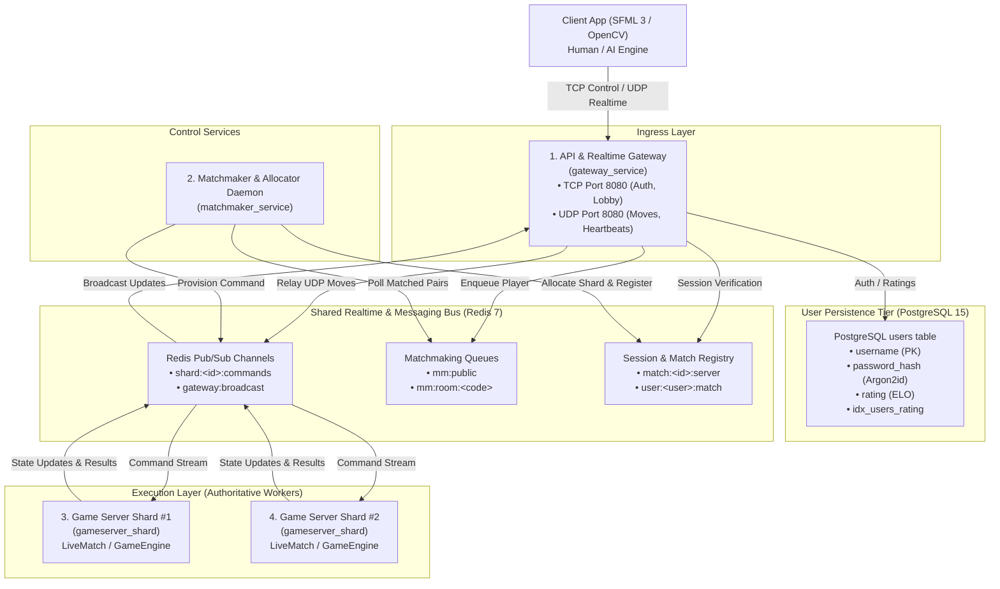

# ♟️ Kung-Fu Chess

An ultra-responsive, real-time simultaneous chess engine and distributed multiplayer gaming platform built with modern C++ (C++17/20), Boost.Asio, SFML 3, and a microservices cloud architecture.


## 🌟 Overview

Kung-Fu Chess revolutionizes standard turn-based chess by removing turns entirely. Both players command their pieces simultaneously in real-time. Once a piece completes a move, it enters a mandatory cooldown period before it can be moved again.

The system incorporates a deterministic real-time physics engine that calculates spatial trajectories, mid-route piece collisions, airborne jump immunities, and automatic premove executions. In addition to local single-player (vs. AI) and local PvP modes, Kung-Fu Chess features a production-ready, horizontally scalable distributed backend supporting real-time online matchmaking, live spectating, and seamless reconnection handling.

## 🎮 Game Rules & Real-Time Mechanics

Unlike traditional chess, Kung-Fu Chess relies on continuous time and spatial interpolation:

- **No Turns & No Check/Checkmate**: Players move any available piece at any time. There are no "check" or "checkmate" states—victory is achieved solely by physically capturing the opponent's King.
- **Piece Cooldowns**: After completing a move, a piece enters a cooldown window (default: 2000 ms). Cooldown indicators (circular progress rings and bars) alert players when a piece is ready for its next command.
- **Continuous Spatial Motion**: Pieces travel across cells at a fixed velocity (`msPerCellSpeed` = 250 ms/cell).
- **Mid-Route Trajectory Collisions**:
  - *Enemy Collisions*: When opposing sliding pieces intersect along overlapping paths at the same time, the piece that initiated its move earlier (initiative priority) captures the latecomer mid-route.
  - *Friendly Collisions*: If a piece's path is blocked by a friendly unit, it stops at the last vacant square along its path.
  - *Knight Immunity*: Knights jump over intervening pieces and are immune to mid-route collisions (though they execute self-captures/friendly captures if landing on friendly units).
- **In-Place Jump (Airborne State)**:
  - Commanding a piece to target its current square (`from == to`) causes it to jump in place into an Airborne state for 600 ms.
  - While airborne, the piece is temporarily removed from the board and is immune to enemy mid-route attacks.
- **Automatic Premove Queue**: Commands issued to pieces that are currently moving or cooling down are automatically queued as premoves and executed immediately when the piece becomes idle.
- **Automatic Pawn Promotion**: Pawns reaching the opposite final rank automatically promote to Queens upon landing.

## 🏗️ System Architecture

The server backend is designed as a decoupled, microservices-based system capable of scaling horizontally across container clusters (Kubernetes / Docker Compose).



### Microservices Breakdown

**API & Realtime Gateway (`gateway_service`)**:
- TCP Control (Port 8080): Handles authentication, account registration, room listing, and spectating requests.
- UDP Realtime (Port 8080): Low-latency transport for `GAME_MOVE`, `MOVE_RESULT`, and keep-alive `HEARTBEAT` messages. Bound to authenticated sessions via a single-use token (`SESSION_BIND` handshake).

**Matchmaker Daemon & Game Allocator (`matchmaker_service`)**:
- Periodically scans Redis queues (`mm:public`), evaluates player ELO ranges, pairs compatible players, and allocates live matches to the least-loaded Game Server Shard via a Round-Robin algorithm.

**Authoritative Game Server Shards (`gameserver_shard`)**:
- Fully isolated worker nodes executing active `LiveMatch` simulation loops (50 ms ticks).
- Executes the core pure C++ `GameEngine` and `RealTimeArbiter` inside thread-safe `boost::asio::strand` contexts.

**Persistence & Caching**:
- **PostgreSQL 15**: Primary database for accounts (`username`, `password_hash`, ELO `rating`).
- **Redis 7**: Distributed pub/sub bus, in-memory matchmaking sets, and session/shard registry.
- **Libsodium**: Cryptographically secure Argon2id password hashing (`crypto_pwhash`).

## ⚡ Dual-Transport Wire Protocol

| Channel | Transport | Wire Messages | Description |
|---|---|---|---|
| Control | TCP | `LOGIN_REQUEST`, `LOGIN_RESPONSE`, `REGISTER_REQUEST`, `REGISTER_RESPONSE`, `JOIN_MATCH_REQUEST`, `MATCH_FOUND`, `ROOM_LIST_REQUEST`, `ROOM_LIST_RESPONSE`, `SPECTATE_ROOM_REQUEST`, `ROOM_STATE_SYNC`, `GAME_OVER`, `DISCONNECT_COUNTDOWN` | Reliable, ordered delivery for session setup, lobby interactions, and match lifecycle notifications. |
| Realtime | UDP | `SESSION_BIND`, `SESSION_BIND_ACK`, `GAME_MOVE`, `MOVE_RESULT`, `HEARTBEAT` | Low-latency, un-choked datagram transport for move packets. The client manages an in-flight retry table with automatic resend attempts up to 5 retries. |

## 🚀 Key Features

**Multiple Game Modes**:
- Real-Time Kung-Fu Mode: Simultaneous action with cooldowns and continuous spatial movement.
- Classic Turn-Based Mode: Standard turn-taking mechanics without cooldowns or jumping.
- Single Player vs. AI: Choose between Easy, Medium, or Hard AI strategies (utilizing Minimax trees and real-time tactical threat evaluation).
- Local PvP & Online Multiplayer: Play locally or against remote opponents via public matchmaking or private room codes.
- Live Room Spectating: Synchronize with live active matches and watch other players in real-time.

**Audio-Visual Presentation Layer**:
- Dual renderers: SFML 3 (rich graphics, 3D piece shadows, glassmorphism UI, particle explosions, spatial audio) and OpenCV (lightweight alternative).
- Real-time interpolation smoothing, capture particle effects, and dynamic UI panels.

**Fault Tolerance & Reconnection**:
- Automatic disconnect detection with a 20-second reconnection countdown timer before triggering auto-forfeiture.
- Server state snapshots (`MatchStateSnapshot`) serialized with clock-independent relative deltas (`elapsedMs`, `remainingMs`).

## 🛠️ Technology Stack

- **Language**: C++17 / C++20
- **Networking & I/O**: Boost.Asio (Async Sockets, Strands, Timers)
- **Graphics & Audio**: SFML 3, OpenCV (optional fallback)
- **Database & Persistence**: PostgreSQL 15 (libpqxx), SQLite3 (local fallback)
- **In-Memory Store & Bus**: Redis 7 (RESP protocol)
- **Security**: Libsodium (Argon2id hashing)
- **Unit & Integration Testing**: Catch2
- **Containerization**: Docker, Docker Compose, Kubernetes manifests

## 📁 Repository Structure

```text
├── app/                        # Application entry points (SFML & OpenCV binaries)
│   ├── main_sfml.cpp
│   └── main_opencv.cpp
├── engine/                     # Pure domain authoritative game engine
│   ├── actions/                # ActionRequest, ActionResult, PlayerAction DTOs
│   ├── analysis/                # MoveGenerator, PositionEvaluator, ThreatAnalyzer, ELO
│   ├── board/                   # Board, Piece models and interfaces
│   ├── common/                  # Positions, GameConfig, Enums, BoardPresets
│   ├── core/                    # GameEngine, MatchController, PremoveQueue
│   ├── events/                  # EventBus, GameEvents
│   ├── realtime/                # RealTimeArbiter, CollisionDetector, CooldownTracker, Motion
│   ├── rules/                   # RuleEngine, CollisionResolver, Piece & Promotion Rules
│   └── snapshot/                # GameSnapshot, MatchStateSnapshot
├── graphics/                    # Rendering implementations
│   ├── sfml/                    # SFML 3 Renderer, Input Translator, Sound Player
│   └── opencv/                  # OpenCV Renderer and Canvas Translator
├── players/                     # Player abstractions
│   ├── ai/                      # Minimax & Real-Time AI strategies (Easy/Medium/Hard)
│   ├── human/                   # Controller, BoardMapper, HumanPlayer
│   └── network/                 # NetworkPlayer, AuthService, LobbyService, NetworkSession
├── server/                      # Server infrastructure & microservices
│   ├── cmd/                     # Binaries: gateway_service, matchmaker_service, gameserver_shard
│   ├── match/                   # LiveMatch, DistributedMatchmaker, GameAllocator, SessionRegistry
│   ├── network/                 # TcpServer, UdpServer, Tcp/Udp Connections, RedisPubSubClient
│   └── persistence/              # PostgresUserRepository, SqliteUserRepository, PasswordHasher
├── integration/                 # Catch2 Integration test suite (AI battles, Network tests)
├── unit/                        # Catch2 Unit test suite (Engine mechanics, collisions, rules)
├── Dockerfile                   # Multi-stage production container build
└── docker-compose.yml           # Distributed stack orchestration setup
```

## 💻 Building and Running

### Prerequisites

- **C++ Compiler**: GCC 11+, Clang 13+, or MSVC 2022+ with C++17/20 support.
- **CMake**: Version 3.20 or higher.
- **Libraries**: Boost (system, thread), SFML 3, Libsodium, SQLite3, libpqxx (PostgreSQL C++ driver), and OpenCV (optional).
- **Services**: Redis 7 and PostgreSQL 15 (if running server infrastructure locally).

### Method 1: Running the Complete Backend Stack via Docker Compose (Recommended)

To spin up the entire distributed cluster (PostgreSQL, Redis, Gateway, Matchmaker, and 2 Game Server Shards):

```bash
# Clone the repository
git clone https://github.com/your-username/kungfu-chess.git
cd kungfu-chess

# Build and start all services in detached mode
docker-compose up --build -d
```

Check the running containers:

```bash
docker-compose ps
```

To view logs across all services:

```bash
docker-compose logs -f
```

### Method 2: Local CMake Native Build

**1. Build Server Binaries and Client**

```bash
mkdir build && cd build
cmake -DCMAKE_BUILD_TYPE=Release ..
make -j$(nproc)
```

**2. Run Unit & Integration Tests**

```bash
# Execute Catch2 test suite
./kungfu_tests
```

**3. Run Graphical Clients**

SFML 3 Client (Primary):

```bash
./kungfu_sfml
```

OpenCV Client (Alternative):

```bash
./kungfu_opencv
```

## ⚙️ Environment Variables & Configuration

The application and microservices support environment-driven overrides:

| Environment Variable | Default Value | Description |
|---|---|---|
| `KUNGFU_SERVER_HOST` | `127.0.0.1` | Remote server IP address for client connections |
| `KUNGFU_SERVER_PORT` | `8080` | Remote server TCP/UDP port for client connections |
| `KUNGFU_TCP_PORT` | `8080` | Gateway TCP listening port |
| `KUNGFU_UDP_PORT` | `8080` | Gateway UDP listening port |
| `KUNGFU_REDIS_HOST` | `127.0.0.1` | Central Redis host |
| `KUNGFU_REDIS_PORT` | `6379` | Central Redis port |
| `KUNGFU_DB_TYPE` | `sqlite` | Database engine selection (`postgres` or `sqlite`) |
| `KUNGFU_DB_PATH` | `kungfu_chess.db` | File path for SQLite database |
| `KUNGFU_POSTGRES_CONN` | `host=127.0.0.1 port=5432 dbname=kungfu user=postgres password=postgres` | PostgreSQL connection string |
| `KUNGFU_SHARD_ID` | `gameserver-1` | Unique identity string for a Game Server Shard instance |

## 🧪 Testing

The test suite covers full domain mechanics, edge cases, real-time sync, and distributed network interaction:

- **Engine Mechanics**: Piece collision resolution, simultaneous jumps, premove overrides, pawn promotions, and threat evaluation.
- **AI Strategies**: Execution safety, non-blocking asynchronous decision trees, and minimax tree depth validation.
- **Network & Serializer**: Big-Endian binary encoding/decoding, TCP frame boundaries, UDP move relaying, and ELO calculations.

Run tests directly:

```bash
./build/kungfu_tests
```

## 📜 License

This project is licensed under the MIT License — see the LICENSE file for details.
