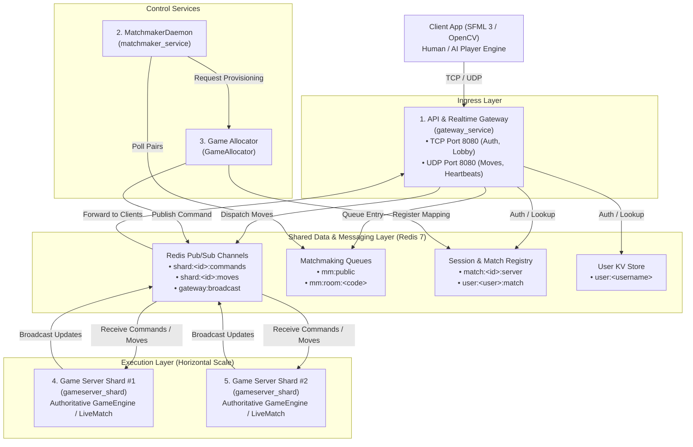
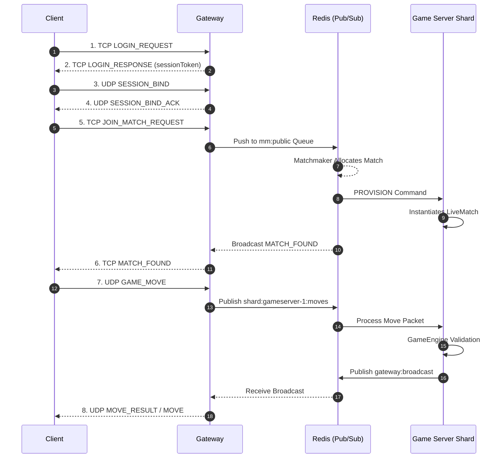

# Kung-Fu Chess — System Architecture & Technical Specification

## 1. Executive Summary & Core Mechanics

Kung-Fu Chess is a real-time, simultaneous chess engine and distributed multiplayer gaming platform written in modern C++ (C++17/20).

Unlike traditional turn-based chess:

- **Turnless Gameplay**: Both players can manipulate any of their available pieces simultaneously in real-time.
- **Piece Cooldowns**: After completing a move, a piece enters a strict cooldown window (e.g., 2000 ms) during which it cannot be issued new move commands.
- **Real-Time Physics & Interpolation**: Pieces slide smoothly across board cells at a fixed velocity (`msPerCellSpeed`).
- **Mid-Route Collisions**: When opposing pieces cross paths along intersecting trajectories, the engine calculates sub-millisecond arrival vectors to resolve mid-route captures.
- **Premove Queue System**: Players can queue actions for pieces currently in motion or under cooldown, which execute automatically upon availability.

The platform supports local gameplay (vs. AI or local PvP), real-time online multiplayer over a custom hybrid protocol, live spectating, and horizontal cloud scalability.

## 2. Distributed Microservices Architecture

The system is organized into decoupled microservices that communicate asynchronously via a central Redis 7 Data & Pub/Sub Layer:



## 3. Microservice Components Breakdown

### 3.1 API & Realtime Gateway Service (`gateway_service`)

**Executable**: `server/cmd/gateway_main.cpp`
**Role**: Client entry point for TCP control and UDP gameplay.

**Responsibilities**:
- Handles client authentication (`LOGIN_REQUEST`, `REGISTER_REQUEST`) against `RedisUserRepository`.
- Manages session lifecycle (`PlayerSession`, `SessionManager`) and `SESSION_BIND` handshakes.
- Proxies high-frequency move commands (`GAME_MOVE`) from clients to the designated Game Server Shard via Redis Pub/Sub.
- Receives match update events from shards and broadcasts them back to connected clients.

### 3.2 Matchmaker & Game Allocator Service (`matchmaker_service`)

**Executable**: `server/cmd/matchmaker_main.cpp`
**Role**: Background pairing daemon and room allocation manager.

**Responsibilities**:
- Periodically polls global Redis matchmaking sets (`mm:public`, `mm:room:<code_id>`).
- Evaluates rating differentials (ELO) and pairs compatible waiting players.
- Invokes `GameAllocator` to select an available Game Server Shard (e.g., Round-Robin strategy).
- Registers the match mapping (`match:<id>:server`) in `RedisSessionRegistry` and dispatches `PROVISION` commands via Redis Pub/Sub.

### 3.3 Authoritative Game Server Shards (`gameserver_shard`)

**Executable**: `server/cmd/gameserver_main.cpp`
**Role**: Authoritative game simulation worker nodes.

**Responsibilities**:
- Operates with zero direct client network sockets for maximum isolation and security.
- Subscribes to shard-specific Redis Pub/Sub command channels (`shard:<shard_id>:commands`).
- Instantiates and executes active `LiveMatch` instances containing the pure C++ `GameEngine` and `RealTimeArbiter`.
- Runs high-frequency tick loops (50 ms) using Boost.Asio steady timers and strands.
- Publishes authoritative state updates and move validation results back to the Gateway.

### 3.4 Inter-Service Messaging Infrastructure (`RedisPubSubClient`)

**Class**: `server/network/RedisPubSubClient`
**Role**: High-performance asynchronous Redis Pub/Sub messenger built on Boost.Asio.

**Features**:
- Native RESP protocol formatting (`PUBLISH` / `SUBSCRIBE`).
- Dual-socket design separating command publishing from continuous push subscription streams.

## 4. Networking & Dual-Transport Protocol



### 4.1 Transport Responsibilities

- **TCP Control Channel (Port 8080)**: Reliable, ordered transport for Login, Registration, Room Listings, Spectating, and Disconnection notifications.
- **UDP Realtime Channel (Port 8080)**: Low-latency datagram transport for `GAME_MOVE`, `MOVE_RESULT`, and `HEARTBEAT` packets.
- **UDP Reliability**: Client maintains an in-flight `pendingMoves` map with automatic retry timeouts up to 5 attempts.

### 4.2 Strand Concurrency

- Each `LiveMatch` instance executes inside an isolated `boost::asio::strand`.
- Guarantees sequential execution of network events, engine tick logic, and timers without global mutex locks.

## 5. Technology Stack & Directory Structure

| Component | Library / Framework | Description |
|---|---|---|
| Core Engine | C++17 / C++20 | Pure domain logic (`GameEngine`, `RealTimeArbiter`, `RuleEngine`). |
| I/O Framework | Boost.Asio | Asynchronous network I/O, timers, strands, and sockets. |
| Data & Pub/Sub | Redis 7 (RESP Protocol) | Shared queues, session registry, NoSQL user store, and Pub/Sub bus. |
| Cryptography | Libsodium | Argon2id password hashing (`crypto_pwhash`). |
| Database Option | SQLite3 | Embedded database alternative for single-process development. |
| Containerization | Docker & Docker Compose | Multi-stage slim container deployment. |

### Directory Layout

```text
├── app/
│   ├── main_sfml.cpp              # SFML graphical client
│   └── main_opencv.cpp            # OpenCV client
├── engine/                        # Core authoritative game engine
│   ├── actions/                   # ActionRequest / ActionResult
│   ├── analysis/                  # Move generator, evaluator, ELO
│   ├── board/                     # Board & Piece entities
│   ├── core/                      # GameEngine & MatchController
│   ├── realtime/                  # RealTimeArbiter & CollisionDetector
│   └── snapshot/                  # MatchStateSnapshot DTOs
├── server/                        # Server infrastructure
│   ├── cmd/                       # Microservice entry points (Binaries)
│   │   ├── gateway_main.cpp       # API & Realtime Gateway
│   │   ├── matchmaker_main.cpp    # Matchmaker & Game Allocator daemon
│   │   └── gameserver_main.cpp    # Authoritative Game Server Shard
│   ├── match/                     # LiveMatch, DistributedMatchmaker, GameAllocator
│   ├── network/                   # TcpServer, UdpServer, RedisPubSubClient
│   └── persistence/               # RedisUserRepository, PasswordHasher
├── Dockerfile                     # Multi-stage microservices build
└── docker-compose.yml             # Distributed stack orchestration
```

## 6. Execution & Container Orchestration

To build and launch the complete distributed microservice cluster:

```bash
docker-compose up --build -d
```

### Orchestrated Containers

- `kungfu_chess_redis`: Central Redis 7 instance (6379).
- `kungfu_gateway`: Ingress API & Realtime Gateway (8080/tcp, 8080/udp).
- `kungfu_matchmaker`: Matchmaker & Allocator daemon.
- `kungfu_gameserver_1`: Authoritative Game Server Shard #1 (`gameserver-1`).
- `kungfu_gameserver_2`: Authoritative Game Server Shard #2 (`gameserver-2`).
