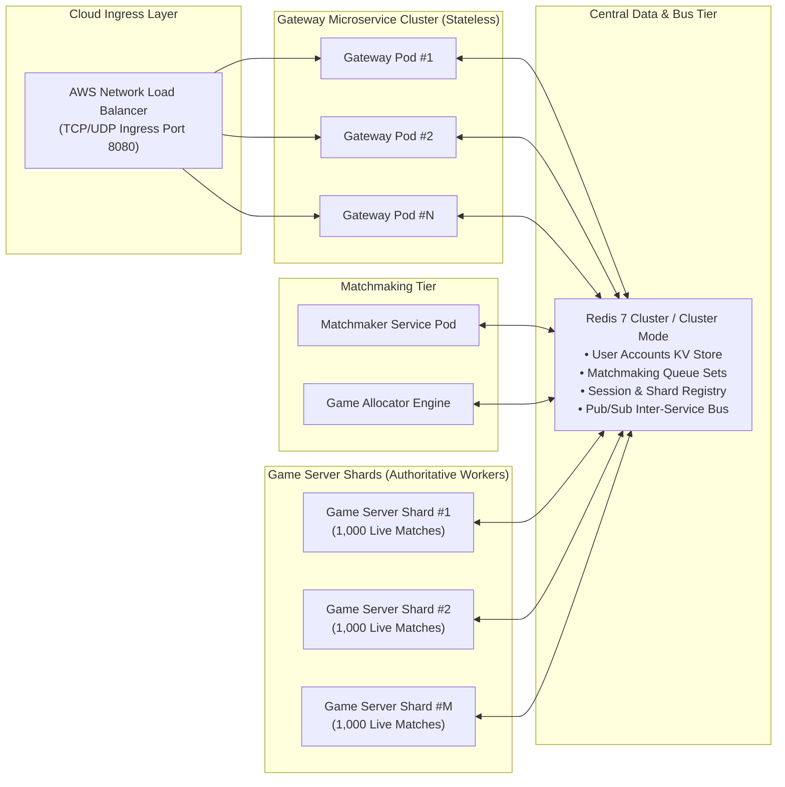
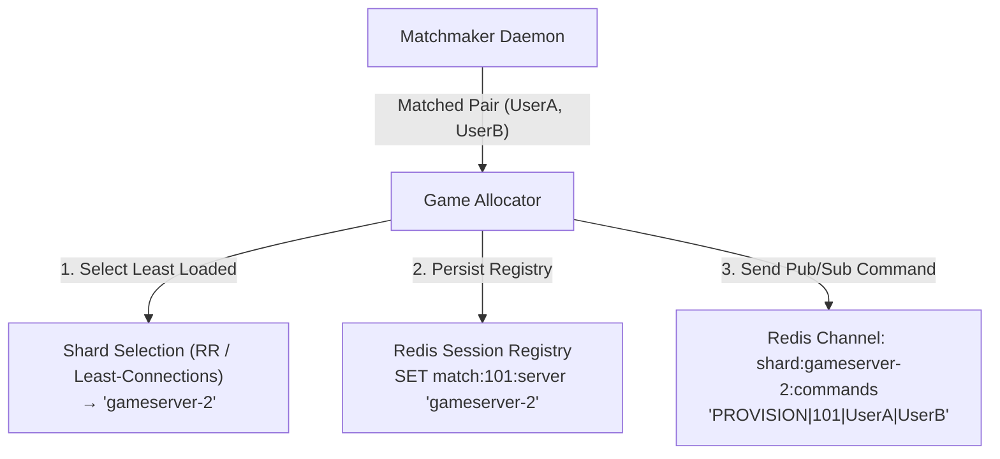
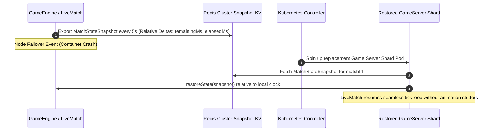

# Distributed Cloud Architecture & Scale Design Specification

## Kung-Fu Chess — Cloud Engineering & Kubernetes Scale Design

This document details the architectural design for scaling the **Kung-Fu Chess** multiplayer platform to support a global user base of **100,000,000 registered accounts** and **10,000,000 concurrent active users (CCU)**.

## 1. Scale Target & Capacity Planning

### 1.1 Workload Estimates (10,000,000 CCU)

- **Active Matches**: Assuming 2 players per match, 10M CCU = **5,000,000 concurrent live matches**.
- **Action Rate**: Average player moves once every 2 seconds = **5,000,000 incoming move messages/sec**.
- **Outbound Traffic**: Each move generates broadcasts to the opponent and spectators = **~10,000,000 outbound updates/sec**.
- **Payload Size**: Compact binary serialization (`NetworkMovePacket`) = **~33 bytes per packet**.
- **Total Network Bandwidth**: 10M × 33 bytes = **330 MB/sec ≈ 2.64 Gbps global network throughput**.

### 1.2 Bottleneck Analysis

- **Bandwidth**: 2.64 Gbps is easily handled by standard cloud ingress/gateway tiers (AWS NLB). Bandwidth is **not** the bottleneck.
- **Primary Bottleneck**: **CPU & Memory compute requirements** for running 5,000,000 real-time `GameEngine` simulation tick loops (50 ms resolution, collision detection, piece cooldown tracking).
- **Architectural Requirement**: Horizontally scalable, headless **Game Server Shards** partitioned across hundreds of container pods.

## 2. Decoupled Service Topology



## 3. Data Tier & Persistence Architecture

### 3.1 Transition from Relational (SQLite) to Distributed NoSQL

- **SQLite Limitations**: File-level locking prevents concurrent write operations across multiple cloud pods.
- **NoSQL Architecture**: User data is structured as key-value entities (`user:<username>` → `{password_hash, rating, wins, losses}`).
- **Repository Abstraction**: The C++ code uses `IUserRepository`, enabling zero-code-change runtime switching between `SqliteUserRepository` (local offline dev) and `RedisUserRepository` (production cloud deployment).

### 3.2 Global Session & Shard Registry

To route incoming real-time UDP move packets to the correct execution shard:

- `match:<match_id>:server` → Stores the target shard identifier (e.g., `"gameserver-142"`).
- `user:<username>:match` → Stores the player's active match ID for instant reconnection and spectate lookups.

## 4. Game Allocator & Shard Partitioning Strategy



- **Decoupled Matchmaking**: `DistributedMatchmaker` pops matched pairs atomically from Redis queues (`SPOP mm:public 2`).
- **Allocation**: `GameAllocator` evaluates active shards and assigns the room based on a Round-Robin or Least-Connections algorithm.
- **Provisioning Signal**: A `PROVISION` payload is dispatched over Redis Pub/Sub directly to the target shard node.
- **Isolated Execution**: The target `gameserver_shard` instantiates a `LiveMatch` instance and executes the simulation loop in an isolated Boost.Asio strand.

## 5. Fault Tolerance & Relative-Time State Snapshots

To survive container pod eviction or node crashes without disrupting active matches:



### 5.1 Relative-Time Timestamp Serialization

To ensure state snapshots remain valid across different physical server node clocks:

- **Active Motions**: Serialized as relative time deltas (`elapsedMs` and `durationMs`).
- **Cooldowns**: Serialized as `remainingMs`.
- Upon restoration, the new node restores cooldowns relative to its own local clock (`currentTimeMs + remainingMs`), preventing piece animation glitches or timing desynchronization.

## 6. Container Roles & Scaling Dimensions

| Container Service | Executable Target | Scale Dimension | Memory / CPU Profile |
|---|---|---|---|
| `gateway` | `gateway_service` | Scale by active client TCP/UDP socket connections | I/O-bound, low CPU, medium RAM. |
| `matchmaker` | `matchmaker_service` | Scale by matchmaking queue throughput | CPU-light, low RAM. |
| `gameserver-shard` | `gameserver_shard` | Scale by active room count (e.g., 1,000 matches/shard) | Compute-heavy (Engine ticks), high CPU, medium RAM. |
| `redis` | `redis:7-alpine` | Clustered / Sharded | Memory-bound, ultra-fast I/O. |

## 7. Kubernetes Deployment Topology (K3s / K8s)

```yaml
# Kubernetes Shard Deployment snippet example
apiVersion: apps/v1
kind: Deployment
metadata:
  name: kungfu-gameserver-shard
spec:
  replicas: 10
  selector:
    matchLabels:
      app: gameserver-shard
  template:
    metadata:
      labels:
        app: gameserver-shard
    spec:
      containers:
      - name: gameserver-shard
        image: kungfu_chess:latest
        command: ["/app/gameserver_shard"]
        env:
        - name: KUNGFU_SHARD_ID
          valueFrom:
            fieldRef:
              fieldPath: metadata.name
        - name: KUNGFU_REDIS_HOST
          value: "redis-service"
        - name: KUNGFU_REDIS_PORT
          value: "6379"
        resources:
          limits:
            cpu: "2000m"
            memory: "2Gi"
          requests:
            cpu: "500m"
            memory: "512Mi"
```
