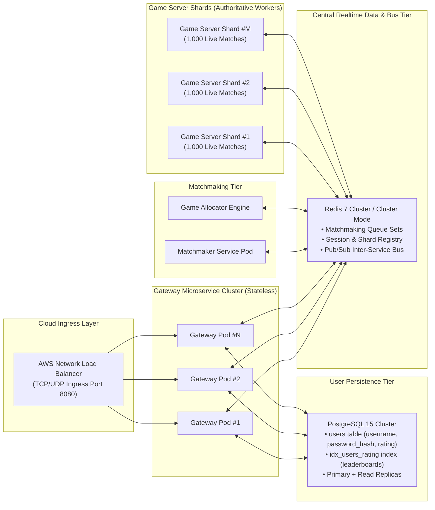
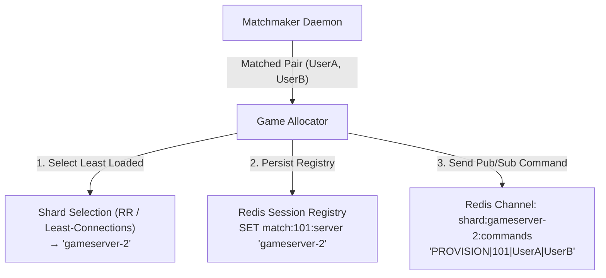
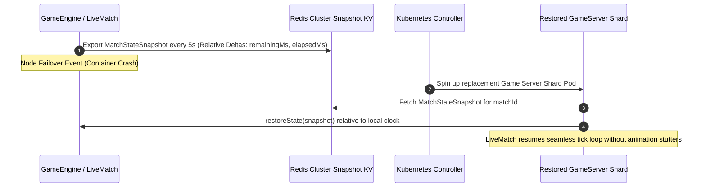

# Distributed Cloud Architecture & Scale Design Specification

## Kung-Fu Chess — Cloud Engineering & Kubernetes Scale Design

This document details the architectural design for scaling the **Kung-Fu Chess** multiplayer platform to support a global user base of **100,000,000 registered accounts** and **10,000,000 concurrent active users (CCU)**.

## 1. Scale Target & Capacity Planning

### 1.1 Workload Estimates (10,000,000 CCU)

- **Active Matches**: Assuming 2 players per match, 10M CCU = **5,000,000 concurrent live matches**.
- **Action Rate**: Average player moves once every 2 seconds = **5,000,000 incoming move messages/sec**.
- **Outbound Traffic**: Each move generates broadcasts to the opponent and spectators = **~10,000,000 outbound updates/sec**.
- **Payload Size**: Compact binary serialization (`NetworkMovePacket`) = **~33 bytes per packet**.
- **Total Network Bandwidth**: 10M × 33 bytes = **330 MB/sec ≈ 2.64 Gbps global network throughput**.

### 1.2 Bottleneck Analysis

- **Bandwidth**: 2.64 Gbps is easily handled by standard cloud ingress/gateway tiers (AWS NLB). Bandwidth is **not** the bottleneck.
- **Primary Bottleneck**: **CPU & Memory compute requirements** for running 5,000,000 real-time `GameEngine` simulation tick loops (50 ms resolution, collision detection, piece cooldown tracking).
- **Secondary Bottleneck**: **Relational write throughput** on the PostgreSQL user store during peak registration/rating-update windows; mitigated via connection pooling and asynchronous rating-update batching (see Section 3).
- **Architectural Requirement**: Horizontally scalable, headless **Game Server Shards** partitioned across hundreds of container pods.

## 2. Decoupled Service Topology



## 3. Data Tier & Persistence Architecture

### 3.1 Transition from Relational File-Based (SQLite) to Distributed Relational (PostgreSQL)

- **SQLite Limitations**: File-level locking prevents concurrent write operations across multiple cloud pods, making it unsuitable as the production user store at cloud scale.
- **PostgreSQL Architecture**: User data is stored in a proper relational schema managed by `PostgresUserRepository` (`server/persistence/PostgresUserRepository.hpp` / `.cpp`), implemented via **libpqxx**:
  - `users` table: `username VARCHAR(64) PRIMARY KEY`, `password_hash VARCHAR(255) NOT NULL`, `rating INTEGER DEFAULT 1200`.
  - `idx_users_rating` index on `rating DESC` to support fast leaderboard and matchmaking-band queries.
- **Repository Abstraction**: The C++ code uses `IUserRepository`, enabling zero-code-change runtime switching between `SqliteUserRepository` (local offline dev) and `PostgresUserRepository` (cloud production).
- **Retired Component**: `RedisUserRepository` has been fully removed from the codebase; Redis is no longer used for user account or credential storage of any kind.

### 3.2 Refactored Role of Redis (Realtime Infrastructure Only)

Redis is retained exclusively as the **Realtime Infrastructure & Pub/Sub Messaging Layer**, with no user-account data:

- **Matchmaking Queues**: `DistributedMatchmaker` operates fast in-memory queue sets (`mm:public`, `mm:room:<code_id>`).
- **Session & Shard Registry**: `RedisSessionRegistry` routes active match and session tokens across nodes.
  - `match:<match_id>:server` → Stores the target shard identifier (e.g., `"gameserver-142"`).
  - `user:<username>:match` → Stores the player's active match ID for instant reconnection and spectate lookups.
- **Pub/Sub Bus**: `RedisPubSubClient` carries inter-service command and move traffic between the Gateway and Game Server Shards.

### 3.3 Global Session & Shard Registry

To route incoming real-time UDP move packets to the correct execution shard, the Redis-backed registry retains the following keys:

- `match:<match_id>:server` → Stores the target shard identifier (e.g., `"gameserver-142"`).
- `user:<username>:match` → Stores the player's active match ID for instant reconnection and spectate lookups.

## 4. Game Allocator & Shard Partitioning Strategy



- **Decoupled Matchmaking**: `DistributedMatchmaker` pops matched pairs atomically from Redis queues (`SPOP mm:public 2`).
- **Allocation**: `GameAllocator` evaluates active shards and assigns the room based on a Round-Robin or Least-Connections algorithm.
- **Provisioning Signal**: A `PROVISION` payload is dispatched over Redis Pub/Sub directly to the target shard node.
- **Isolated Execution**: The target `gameserver_shard` instantiates a `LiveMatch` instance and executes the simulation loop in an isolated Boost.Asio strand.
- **Rating Lookups**: Prior to pairing, `MatchmakerDaemon` queries player ratings from PostgreSQL (via `IUserRepository`) to evaluate ELO differentials; only the matchmaking queue membership itself lives in Redis.

## 5. Fault Tolerance & Relative-Time State Snapshots

To survive container pod eviction or node crashes without disrupting active matches:



### 5.1 Relative-Time Timestamp Serialization

To ensure state snapshots remain valid across different physical server node clocks:

- **Active Motions**: Serialized as relative time deltas (`elapsedMs` and `durationMs`).
- **Cooldowns**: Serialized as `remainingMs`.
- Upon restoration, the new node restores cooldowns relative to its own local clock (`currentTimeMs + remainingMs`), preventing piece animation glitches or timing desynchronization.

Match state snapshots remain entirely within Redis; PostgreSQL is not involved in the fault-tolerance hot path, keeping shard recovery latency independent of relational database performance.

## 6. Container Roles & Scaling Dimensions

| Container Service | Executable Target | Scale Dimension | Memory / CPU Profile |
|---|---|---|---|
| `gateway` | `gateway_service` | Scale by active client TCP/UDP socket connections | I/O-bound, low CPU, medium RAM. |
| `matchmaker` | `matchmaker_service` | Scale by matchmaking queue throughput | CPU-light, low RAM. |
| `gameserver-shard` | `gameserver_shard` | Scale by active room count (e.g., 1,000 matches/shard) | Compute-heavy (Engine ticks), high CPU, medium RAM. |
| `redis` | `redis:7-alpine` | Clustered / Sharded | Memory-bound, ultra-fast I/O. |
| `postgres` | `postgres:15-alpine` | Vertically scaled Primary + Read Replicas | Storage-bound, moderate CPU, durable disk I/O. |

## 7. Kubernetes Deployment Topology (K3s / K8s)

```yaml
# Kubernetes Shard Deployment snippet example
apiVersion: apps/v1
kind: Deployment
metadata:
  name: kungfu-gameserver-shard
spec:
  replicas: 10
  selector:
    matchLabels:
      app: gameserver-shard
  template:
    metadata:
      labels:
        app: gameserver-shard
    spec:
      containers:
      - name: gameserver-shard
        image: kungfu_chess:latest
        command: ["/app/gameserver_shard"]
        env:
        - name: KUNGFU_SHARD_ID
          valueFrom:
            fieldRef:
              fieldPath: metadata.name
        - name: KUNGFU_REDIS_HOST
          value: "redis-service"
        - name: KUNGFU_REDIS_PORT
          value: "6379"
        resources:
          limits:
            cpu: "2000m"
            memory: "2Gi"
          requests:
            cpu: "500m"
            memory: "512Mi"
```

```yaml
# Kubernetes Gateway Deployment snippet example (PostgreSQL + Redis dependencies)
apiVersion: apps/v1
kind: Deployment
metadata:
  name: kungfu-gateway
spec:
  replicas: 5
  selector:
    matchLabels:
      app: gateway
  template:
    metadata:
      labels:
        app: gateway
    spec:
      containers:
      - name: gateway
        image: kungfu_chess:latest
        command: ["/app/gateway_service"]
        env:
        - name: KUNGFU_REDIS_HOST
          value: "redis-service"
        - name: KUNGFU_REDIS_PORT
          value: "6379"
        - name: KUNGFU_POSTGRES_CONN
          valueFrom:
            secretKeyRef:
              name: kungfu-postgres-secret
              key: connection-string
        resources:
          limits:
            cpu: "1000m"
            memory: "1Gi"
          requests:
            cpu: "250m"
            memory: "256Mi"
```

```yaml
# Kubernetes PostgreSQL StatefulSet snippet example
apiVersion: apps/v1
kind: StatefulSet
metadata:
  name: kungfu-postgres
spec:
  serviceName: postgres-service
  replicas: 1
  selector:
    matchLabels:
      app: postgres
  template:
    metadata:
      labels:
        app: postgres
    spec:
      containers:
      - name: postgres
        image: postgres:15-alpine
        ports:
        - containerPort: 5432
        env:
        - name: POSTGRES_DB
          value: "kungfu_chess"
        - name: POSTGRES_USER
          valueFrom:
            secretKeyRef:
              name: kungfu-postgres-secret
              key: username
        - name: POSTGRES_PASSWORD
          valueFrom:
            secretKeyRef:
              name: kungfu-postgres-secret
              key: password
        volumeMounts:
        - name: postgres-data
          mountPath: /var/lib/postgresql/data
        resources:
          limits:
            cpu: "2000m"
            memory: "4Gi"
          requests:
            cpu: "500m"
            memory: "1Gi"
  volumeClaimTemplates:
  - metadata:
      name: postgres-data
    spec:
      accessModes: ["ReadWriteOnce"]
      resources:
        requests:
          storage: 100Gi
```
